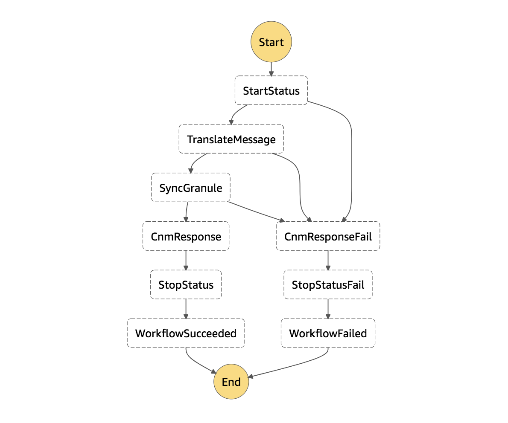

# Error Handling in Workflows

Error handling in workflows is mostly the responsibility of workflow configuration. AWS Step Functions enable users to configure what happens next when an exception is thrown in any state. See the AWS docs for all configuration options: [How Step Functions Works: Error Handling](https://docs.aws.amazon.com/step-functions/latest/dg/concepts-error-handling.html).

Best practice is Cumulus Workflow Tasks _should_ throw errors and rely on the state machine logic to handle the error state. Errors and exceptions thrown in Cumulus Workflow Tasks using the Cumulus Message Adapter (CMA) are caught and rethrown by the CMA libraries _unless_ the error name contains `WorkflowError`.

The former (errors which are not `WorkflowError`s) are the expected scenario when workflow tasks throw an error. However a `WorklowError` can be used to handle errors that should not result in task failure.

## Workflow Configuration

The best practices for error handling in Cumulus Workflows are:

* Include the `sf2snsEndLambdaFunction` as a final state (aka the `StopStatus` state)
* Every state should include a `Catch` configuration object which defines the `ResultPath` to be `$.exception`. This passes along the entire Cumulus Message to the next state with the addition of the `Error` and `Cause` details of the thrown error in the `exception` key.
* NOTE: If a task throws an error which is caught by the workflow configuration and passed to another state which also uses the CMA, the CMA overrides the exception key so the exception would not be passed to downstream tasks after the next state. This is okay if the exception is not needed in downstream tasks and / or the only downstream tasks are terminal tasks handling the error state.
* If multiple downstreams tasks should run after a workflow task has thrown an error, for example sending a failure to a kinesis stream in addition to running the `sf2snsEndLambdaFunction`, this can handled by creating a second "failure" branch of the workflow. Example:

```
KinesisTriggerTest:
  Comment: 'Tests Workflow from Kinesis Stream'
  StartAt: StartStatus
  States:
    StartStatus:
      Type: Task
      Resource: ${SfSnsReportLambdaFunction.Arn}
      Catch:
        - &ErrorEqualDefaults
          ErrorEquals:
          - States.ALL
          ResultPath: '$.exception'
          Next: CnmResponseFail
      Next: TranslateMessage
    TranslateMessage:
      Type: Task
      Resource: ${CNMToCMALambdaFunction.Arn}
      Catch:
        - <<: *ErrorEqualDefaults
      Next: SyncGranule
    SyncGranule:
      Type: Task
      Resource: ${SyncGranuleLambdaFunction.Arn}
      Catch:
        - <<: *ErrorEqualDefaults
      Next: CnmResponse
    CnmResponse: &CnmResponseDefaults
      Type: Task
      Resource: ${CnmResponseLambdaFunction.Arn}
      Catch:
        - <<: *ErrorEqualDefaults
          Next: StopStatus
      Next: StopStatus
    CnmResponseFail:
      <<: *CnmResponseDefaults  
      Catch:
        - <<: *ErrorEqualDefaults
          Next: StopStatusFail          
      Next: StopStatusFail     
    StopStatus: &StopStatusDefaults
      Type: Task
      Resource: ${sf2snsEndLambdaFunction.Arn}
      Next: WorkflowSucceeded
    StopStatusFail:
      <<: *StopStatusDefaults
      Catch:
        - ErrorEquals:
          - States.ALL
          Next: WorkflowFailed
      Next: WorkflowFailed
    WorkflowSucceeded:
      Type: Succeed
    WorkflowFailed:
      Type: Fail
      Cause: 'Workflow failed'
```

This results in a workflow which is visualized in the diagram below:



## Summary

Error handling should be the domain of workflow configuration.
